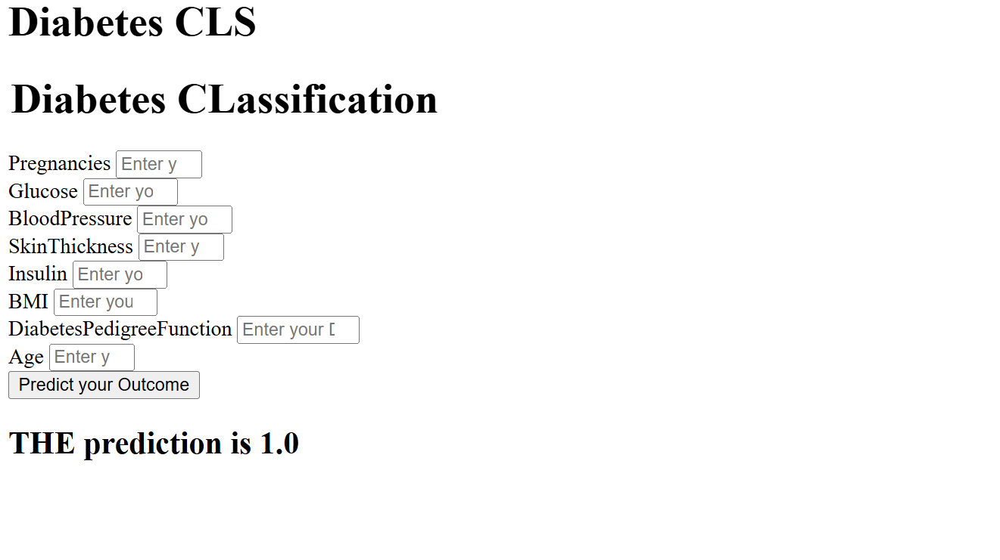

The diabetes.csv dataset from Kaggle, available at https://www.kaggle.com/datasets/saurabh00007/diabetescsv/data 

This data is a widely used dataset for predicting diabetes based on diagnostic measurements

The dataset contains 768 instances (rows) and 9 features (columns), including the target variable. All features are numeric, and there are no missing values in the dataset.

Features of diabetes.csv :

    1. Pregnancies: Number of times the patient has been pregnant (int)
    2. Glucose: Plasma glucose concentration (measured in mg/dL) from a 2-hour oral glucose tolerance test.(int)
    3. BloodPressure: Diastolic blood pressure (mm Hg) (int)
    4. SkinThickness: Triceps skin fold thickness (mm), a measure of subcutaneous fat.(int)
    5. Insulin: 2-hour serum insulin level (mu U/ml)(int)
    6. BMI (Body Mass Index): Body mass index (weight in kg / (height in m)²).(int)
    7. DiabetesPedigreeFunction: A function that scores the likelihood of diabetes based on family history (int)
    8. Age: Age of the patient (years).(int)
    9. Outcome (Target Variable): Binary classification label indicating whether the patient has diabetes.

# Performance

# My Deployment : 

    